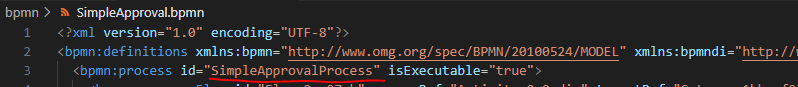
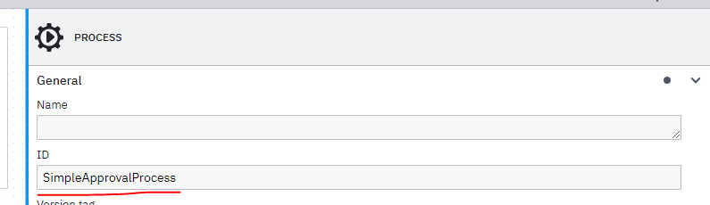

## Steps

list of all command BPMN command check out TestBPMN.feature for live example

 ```feature
 Given start process with input {string} using process id {string}
 ```

Start a new bpmn process with given input json.

 - from bpmn file
    
    
- or from process designer
    

 new process instance id is stored in the context and this used in the futher task and process command.Note if multiple call start processs command called the all actions performed in last created process instance

---
```feature
Given start process using process id {string} 
```
Same as previous command but with no inputs

---

```feature
Given deploy bpmn file {string} 
```

Deploy a bpmn file to server, accepts .bpmn file path as input

---

```feature
Then find task with subject {string} and assign to user {string}
```

Command first search for task with variable name "taskSubject" matches the input value and assign the task to the user.
Post assignment retrives the task details to verify the assigments so no addtional step required fro verify the assignment.Note task search does wait  and multiple retries tofind the task. 

---

```feature
Then find task with subject {string} and complete task with {string} 
```

Command first search for task with variable name "taskSubject" matches the input value and complete the task with given input json.Note task search does wait and multiple retries to find the task. 

---

```feature
Then verify is process status is {string} 
```

Command check the state of the process.Accepst value ACTIVE,CANCELLED,COMPLETED
Does multiple wait and retry call before if fails.

---

```feature
Given delete all process instances with status {string} 
```

Delete all the process instance.Helps to create clean environment for testing.
Accept only CANCELED,COMPLETED for active instance first cancel the instance before this command.

---


```feature
Given cancel all active instances 
```
This command cancel all active instance similar to action done in operate portal.


### Utils

Few command for debugging purpose

```feature
Then wait {float} sec 
```

wait for n number for seconds.All command use build in retry mechanism so avoid this command.This may result in flaky test.

---

```feature
Given get process instance details {string} 
```

command prints the instance details in the console