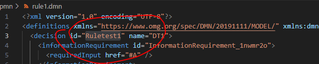
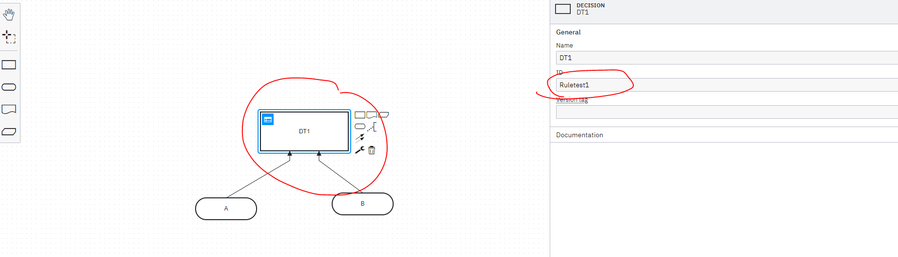

## Steps

list of all command DMN testing commands check out TestDMN.feature for live example

```feature
Given deploy dmn file {string} 
```

Deploy a dmn file to server, accepts .dmn file path as input

---

 ```feature
Given evaluate decision {string} with input  {string}  and match {string}
 ```

Evaluate a decision for the give rule id

 - from dmn file
    
    
- or from process designer
    

 The command takes JSON string as input.

 The output returned is converted to JSONs and compared to the given.

 Uses chai js [assert.deepEqual](https://www.chaijs.com/api/assert/) function to compare the object.

 Note you can use senario outline pattern to match for mulitple decisions

 ```feature
 Scenario Outline: Rule execution
        Then evaluate decision "Ruletest1" with input  <input>  and match <output>
        Examples:
            | input | output | 
            | '{"A" : 1 , "B" : 1 }' | '{"C" : 2 , "D" : "OK"}' |
            | '{"A" : 1 , "B" : 2 }' | '{"C" : 3 , "D" : "OKOK"}' |
            | '{"A" : 3 , "B" : 1 }' | '{"C" : 4 , "D" : "OKOKOK"}' |
            | '{"A" : 10 , "B" : 1 }' | 'null' |
 ```

checkout TestDMN.feature file for more details.

---


 