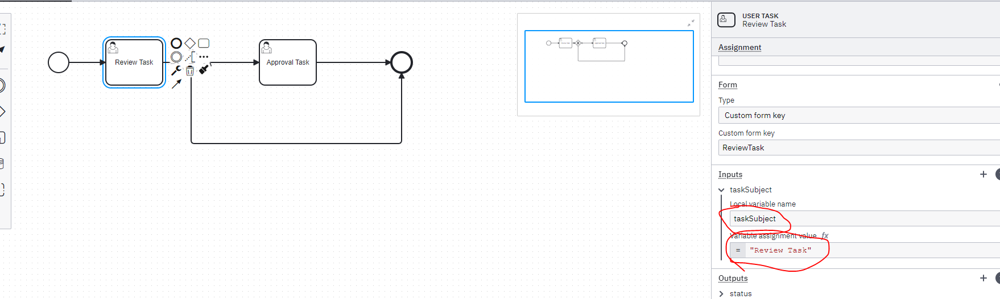

## Preparing BPMN process for testing

 By default, Camunda assigns a generic task subject, which makes it challenging to differentiate tasks within a process.

To enable task searching, you should set a variable named taskSubject so that the test commands can locate the task.

To do this, set a variable as shown below and make the subject unique by appending values such as case numbers or customer numbers.

 

